<!--
This README page layout and content is optimized for the VSCode Marketplace
rather than for the github repo. A title or banner are not needed since the marketplace auto generates a banner with the extension name and icon.
-->

&nbsp;&nbsp;&nbsp;&nbsp;&nbsp;&nbsp;

---

Apio IDE is an easy-to-install, easy-to-use Visual Studio Code extension for end-to-end FPGA design, including building, verification, simulation, and programming FPGA boards. It is 100% open source and free to use.

 

Simulation example:

## Description

Apio IDE is an easy to install extension that brings the full FPGA design functionality of Apio CLI to the Microsoft Visual Studio IDE. It’s simple to install, no toolchains, licenses, or makefiles required, and works across Linux, Windows, and macOS. Apio IDE is 100% open source, and free to use.

Apio IDE supports every stage of the FPGA workflow, from simulating and testing, to building and programming the FPGA, using simple menu commands and buttons such as `test`, `build`, and `upload` that do what you expect them to do. Apio IDE also provides full access to Apio CLI commands via an integrated shell.

Apio IDE currently supports over 80 FPGA boards, custom boards can be easily added, and it includes over 60 ready-to-use example projects. Apio CLI currently supports the ICE40, ECP5, and GOWIN FPGA architectures.

## Sample Apio IDE session

---

## Getting Started

1. **Install the Apio IDE extension**
   I the Extension tab of VSCode, search for the extension `fpgawars.apio` (Apio FPGA) and install it.

2. **Open the Apio Demo project**
   Select `TOOLS → examples → demo project`

3. **Build the project**
   Use the **Apio status bar buttons** to lint, build, test, simulate, etc.

4. Explore the full command list in the **Apio sidebar**.

---

## Resources

- [Apio CLI Documentation](https://fpgawars.github.io/apio/docs/)
- [Getting started with Apio](https://fpgawars.github.io/apio/docs/quick-start)
- [Apio IDE github repository](https://github.com/fpgawars/apio-vscode)
- [Apio IDE on the VS Code market](https://marketplace.visualstudio.com/items?itemName=fpgawars.apio)
- [Apio IDE daily build](https://github.com/fpgawars/apio-vscode/releases)

---

## Sample screens and commands

**The no-project screen.** - The Apio extension offers to open a project or to create one.
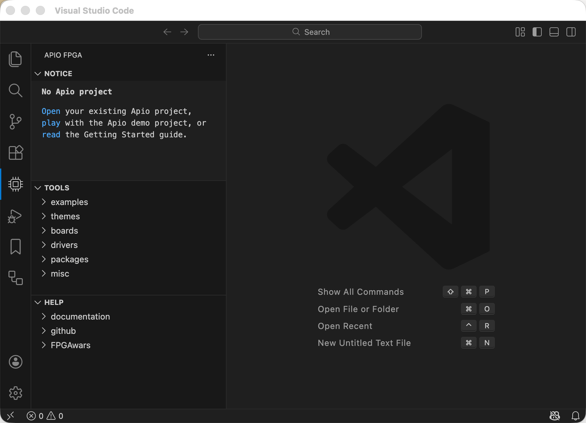

---

**Creating a project from an example.** - The `get example...` command provides a form to select the board, example, and output directory of a new example project.
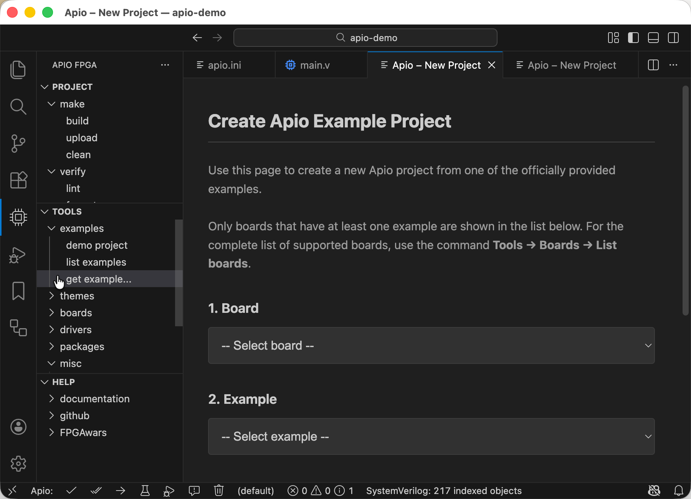

---

**Building the project** - The `build` command builds the project and reports of any errors it found.
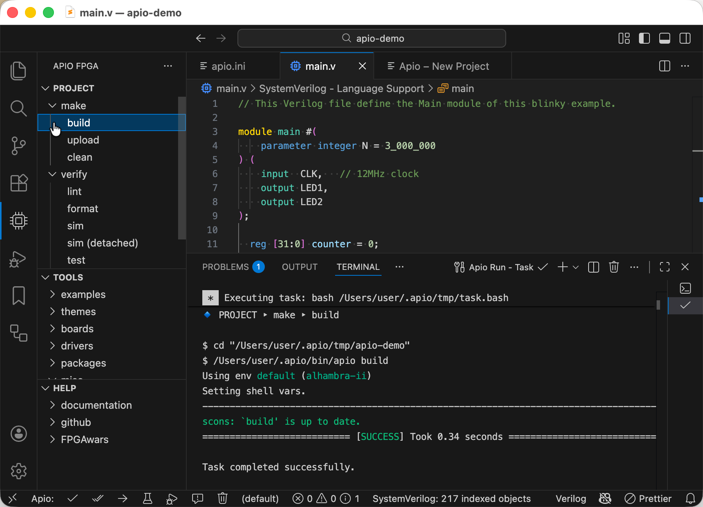

---

**Building the project using the quick access buttons** - The Apio buttons in the status bar provides quick access to selected Apio IDE menu commands.
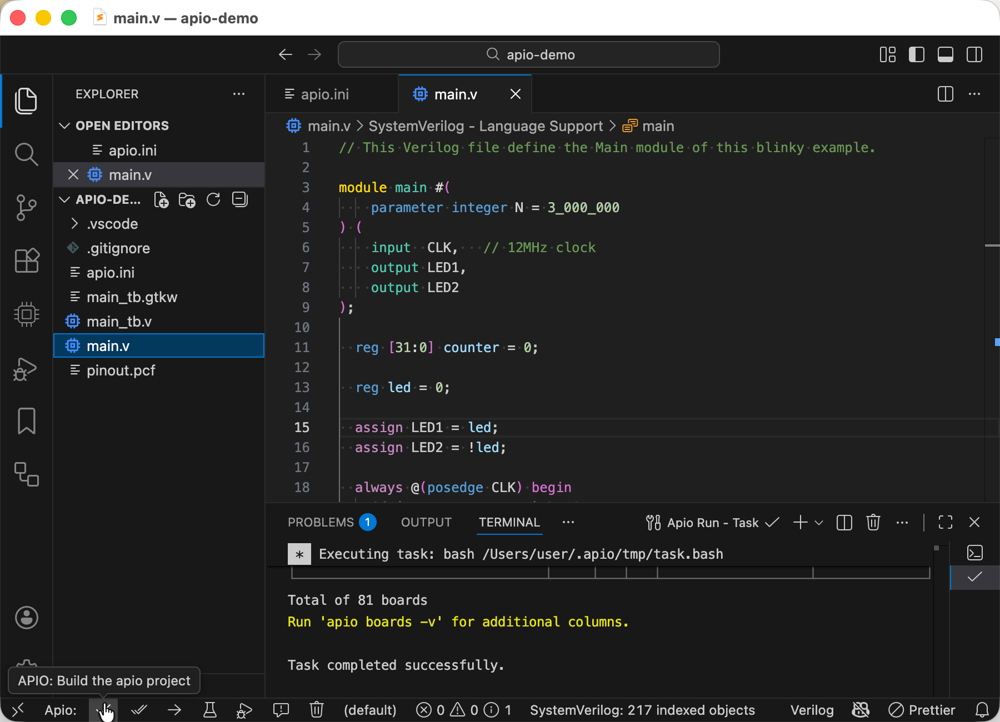

---

**Linting the project** - The `lint` command checks the project for additional errors and style violations.
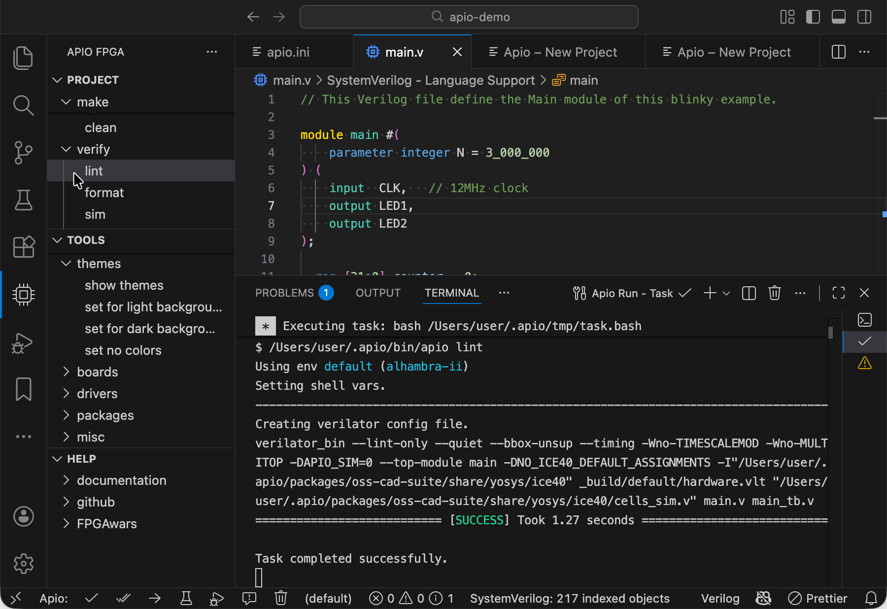

---

**Verifying utilization and speed** - The `report` summarizes the FPGA cells utilization and the maximal clock speed that the design can sustain.
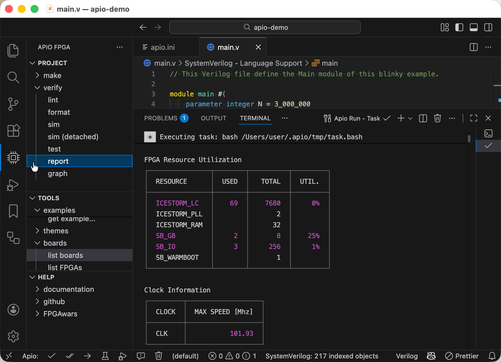

---

**Running the project tests** - The `test` command runs all the project testbenchs in batch mode and fails if any of them fails on an assertion.
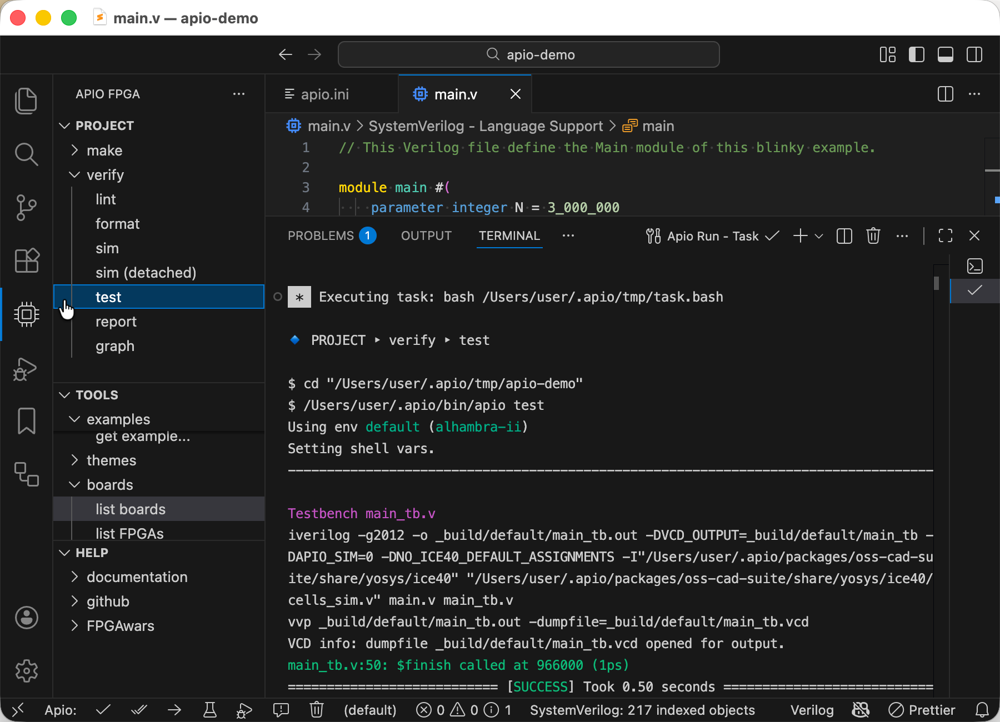

---

**Running interactive simulation** - The `sim` command runs a single testbench and shows it signals for debugging.\*\*
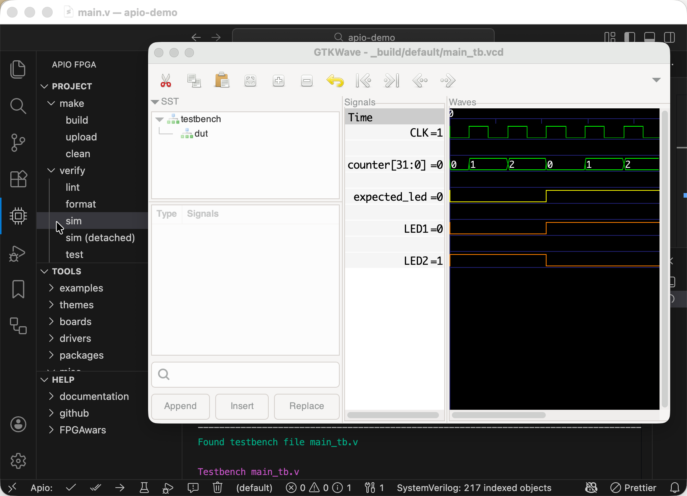

---

**Programming the FPGA board** - The `upload` command builds the projects and upload it to an attached FPGA board.
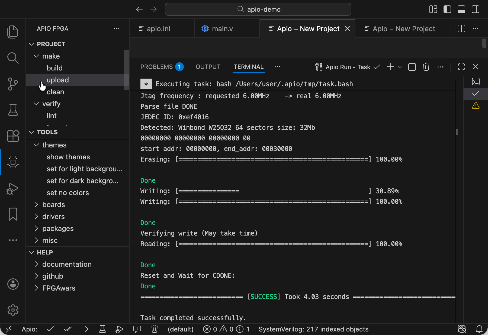

---

**Selecting the active project env** - In Apio project that define multiple build 'envs' (targets), clicking the env field in the status bar allows to the select the active env.
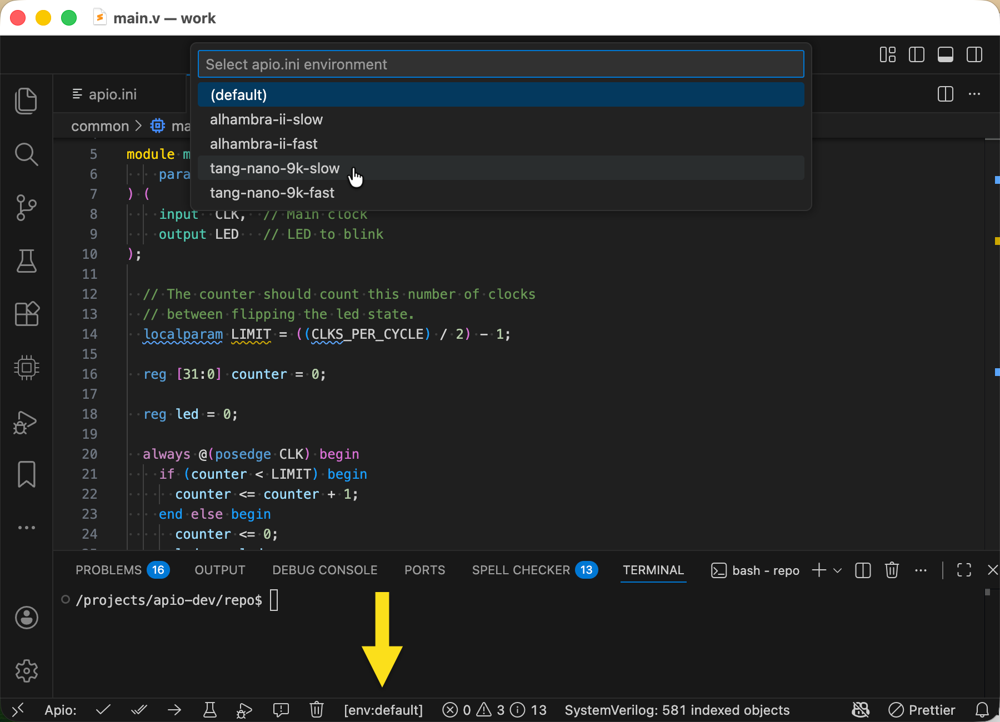

---

**Invoking Apio CLI commands** - The `apio shell` command provides an interactive shell with full access to Apio CLI's commands.
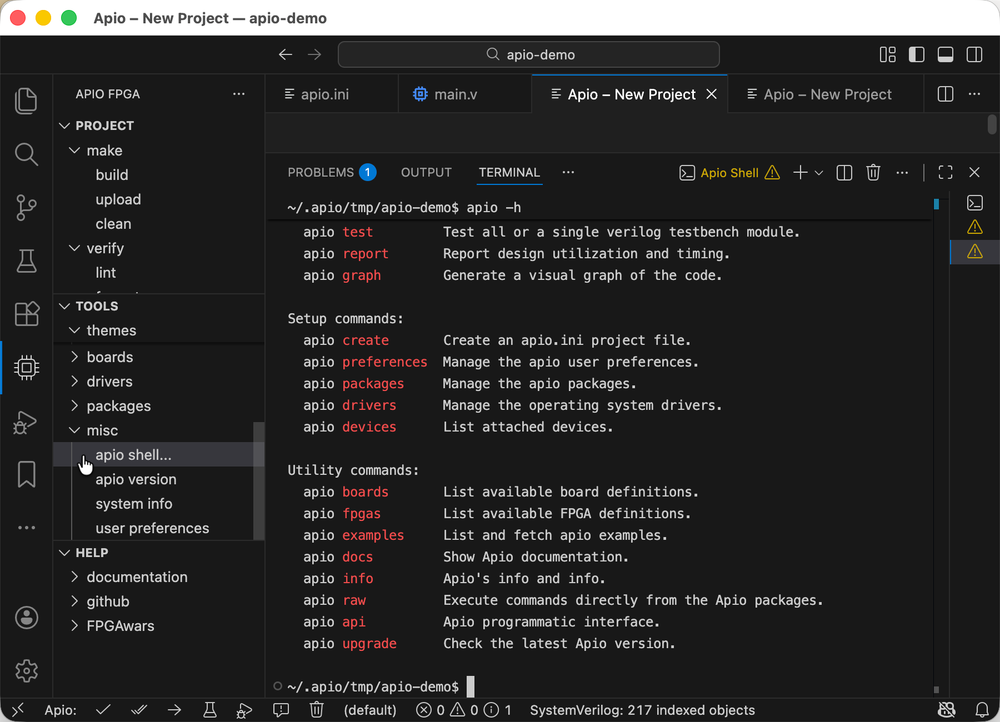

---

## License

The Apio project itself is licensed under the GNU General Public License version 3.0 (GPL-3.0).
Pre-built packages may include third-party tools and components, which are subject to their
respective license terms.

---

_Happy FPGA hacking!_
